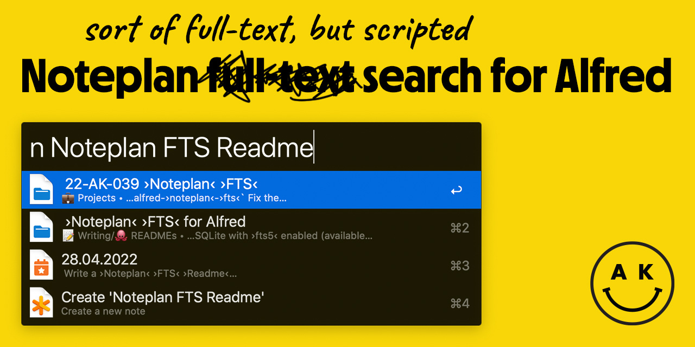

# Full-text (scripted) Noteplan search for Alfred

A simpler version of my [Noteplan Full-Text Search for Alfred](https://github.com/adamkiss/alfred-noteplan-fts) for non-programmers. Useful if you can't/don't want to setup Homebrew/PHP for the bigger brother.

---

## Usage (In beta versions)
- `sn [Search phrase]` - Full text search. If there isn't any note available, "Create new note" command is the only result
- `snn Title of the note` - Creates a new note, in the folder of your choice
- In first `non-beta` version, these will be switched to `n` and `nn` respectively

## Installation
1. Download the workflow
2. Open it, which will add it to alfred
3. Customize the options you're propmted about
    - `np_root` - required, absolute path to your Noteplan data folder
        - You can find it in Settings: Settings → Sync → [Sync method] → Advanced → Open Local Database Folder
    - `format_calendar_title` - Formatting function for the Calendar entries. Uses [strftime format](https://strftime.org)
    - `format_new_note` - text content of the new note
        - use `{title}` as a placeholder for the title of the new note you'll enter
        - despite what alfred shows, you can actually enter mutliline text
        - by default, it's the title in the new Frontmatter format
4. Try to search for a note. macOS will warn you about "potentially dangerous software" being disallowed to run
    - these are just packaged versions of used programs - [RipGrep](https://github.com/BurntSushi/ripgrep) and [JQ](https://github.com/stedolan/jq)
    - you have to go to Preferences → Security & Privacy → General and click the allow anyway button
    - You have to do this twice - first for jq, second time for ripgrep

## Differences between `alfred-noteplan-fts` and `alfred-noteplan-fts-simple`
- this version doesn't use `PHP` or `SQLite`, but executes a live search over your notes
- **pros**
	- you don't have to have programmer tools installed or muck around with files for config
	- there's no cache/database, so it's always the latest version of your notes being searched
- **cons**
	- roughly 10 times slower (`~500ms` vs `~50ms` for 500 notes)
	- matches aren't weighted, but alphabetical
	- notes are always first, calendar entries second

## License
MIT License

---

© 2022 Adam Kiss